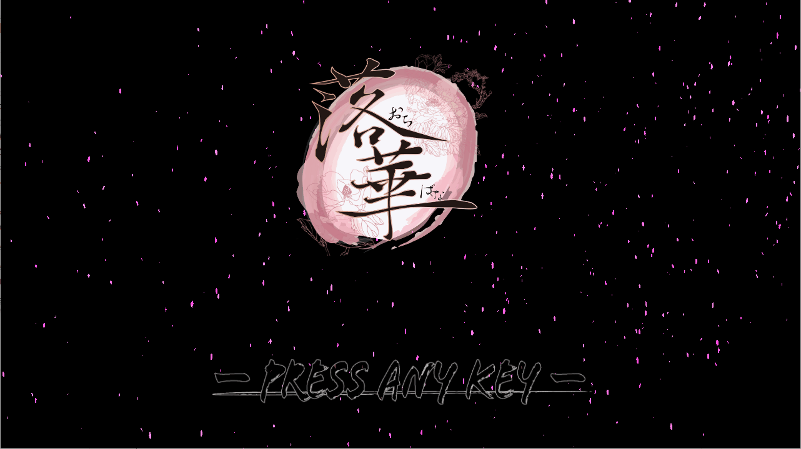
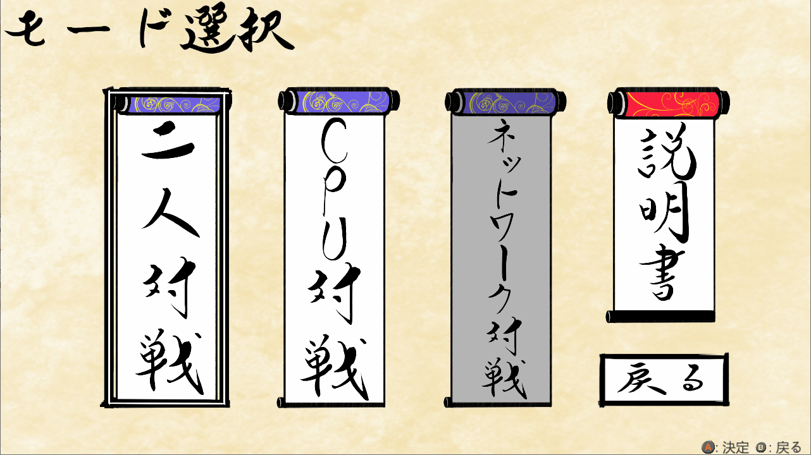
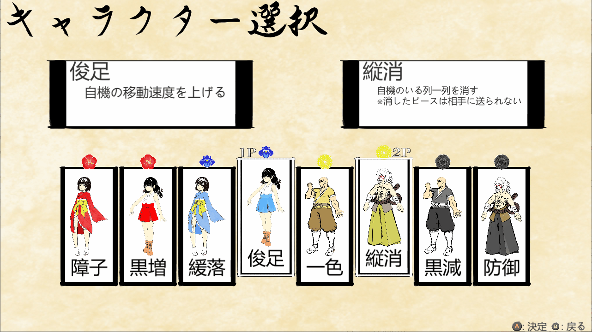
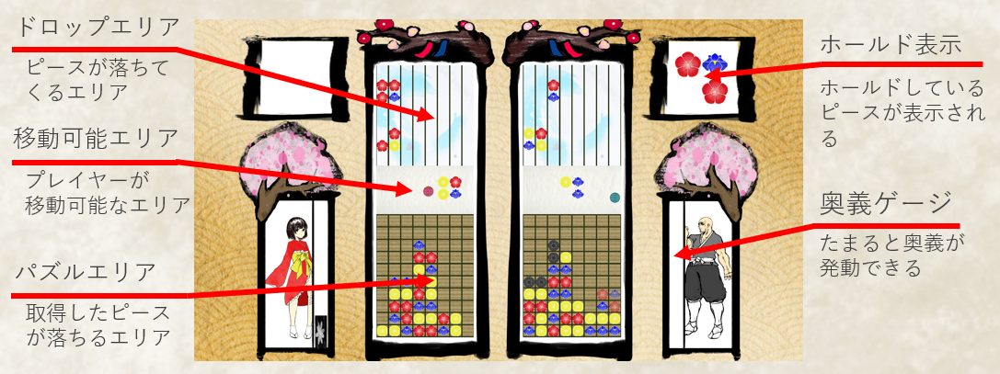
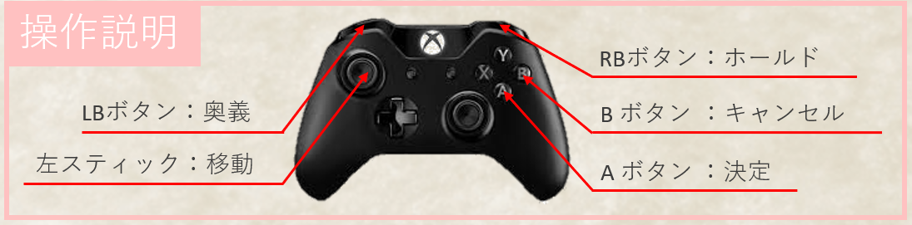

# 落華
## コンセプト
### パズル×避け
+ パズルと避けゲーを組み合わせた1対1で戦う​対戦型のパズルゲーム​

# ゲームの流れ
## タイトル画面

## モード選択画面

### 二人対戦
+ ２人が１台のパソコンで対戦するモード
### CPU対戦
+ CPUと対戦できる１人用のモード
### ネットワーク対戦
+ 複数台のパソコンで２台ずつマッチングして対戦するモード
### チュートリアル
+ 落華の基本的な遊び方を学ぶことができる

## キャラクター選択

+ 選択中の奥義は1Pは左上2Pは右上で確認可能
+ 両プレイヤーが選択状態で決定ボタンを押してゲームを開始する

## ゲーム画面

### 画面解説

### 操作方法

# ゲーム内容
## ルール
1. 落ちてくるピースと自機がぶつかると​ピースがパズルエリアに落ちる​
2. 同じ色のピースを4つ以上繋げるとピースが消える​
3. 消したピースは消した列に消した形の黒いピース​として相手に送られる 
4. 黒いピースは消すことができない
5. ピースが一定以上積みあがると負けてしまう

## 奥義
+ ピースを消すことでたまる奥義ゲージが​最大までたまっているときに​発動ができる必殺技​
+ 奥義は8種類
+ 奥義によって発動までに​消すピースの量や効果時間が異なる

## ホールド
+ RBボタンを押している状態でピースにぶつかると​そのピースをホールドできる
+ ホールド中はRBボタンを離すことで​好きなタイミングで落とすことができる​
+ ホールド中にほかのピースにぶつかると​ピースがその場に落下してしまい​ぶつかったピースを新しくホールドする​